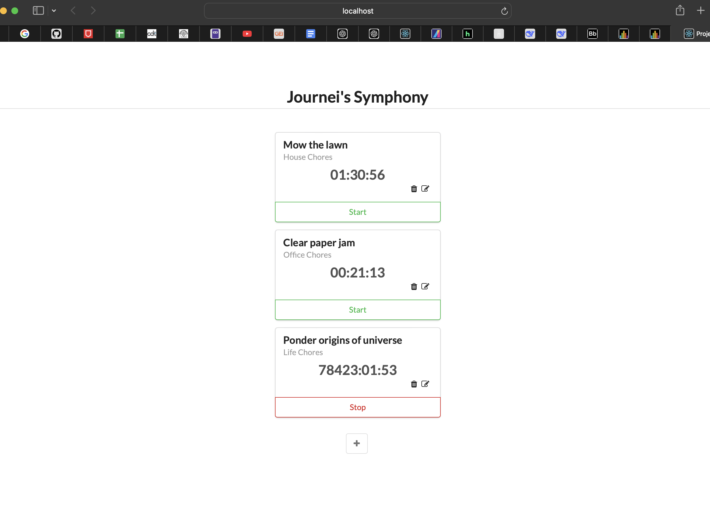

# ⏱ Time Tracking App  

## 📖 Overview  
This is a simple time-tracking app built with React. It allows users to track time spent on different tasks and provides persistence using a JSON file.  

## How to Run the App

1. **Install Dependencies**  
   First, open your terminal and run the following command to install the necessary dependencies:

2. **Start the HTTP Server**  
Once the dependencies are installed, run the following command to boot the server:

The server will be running at **http://localhost:3000**.

3. **Open the App in Your Browser**  
Open your browser and go to **http://localhost:3000** to see the app in action.

## How to Use the App
- Click **"Start Timer"** to begin tracking time for a task.
- Click **"Stop Timer"** when done.
- Click **"Edit"** to modify task details.
- Click **"Delete"** to remove a task.
- Refresh the page—your data will be saved even after closing the app.

## Screenshot  

